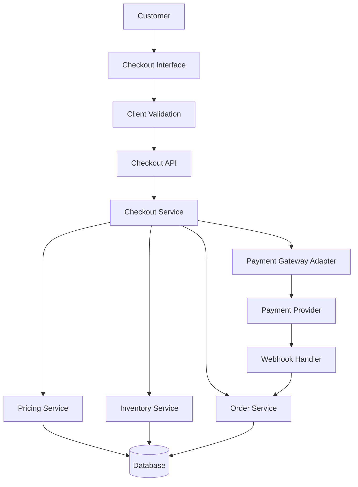
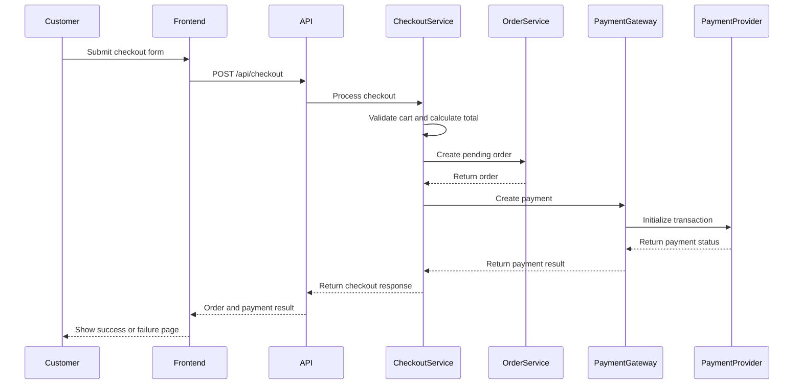

# Checkout Demo

A modern checkout demo built to showcase a clean, scalable, and maintainable e-commerce checkout architecture.

> This project is intended for demonstration and development purposes. It does not process real payments unless a payment provider is properly configured.

## Features

* Customer information form
* Shipping address management
* Shipping method selection
* Order summary
* Discount code support
* Multiple payment methods
* Client-side and server-side validation
* Mock payment processing
* Payment success and failure pages
* Responsive checkout interface
* Order status management

## Technical Architecture

The project separates the user interface, business logic, data access, and payment integration into independent layers.



## Architecture Layers

### Presentation Layer

The presentation layer displays the checkout interface and collects information from the customer.

Its responsibilities include:

* Rendering checkout steps
* Collecting customer and shipping information
* Displaying available payment methods
* Showing the order summary
* Performing basic form validation
* Handling loading and error states
* Redirecting customers after checkout

The frontend must not be treated as a trusted source for product prices, discounts, shipping fees, or final totals.

### API Layer

The API layer acts as the communication point between the frontend and backend services.

Its responsibilities include:

* Validating incoming requests
* Sanitizing customer input
* Verifying the checkout session
* Preventing duplicate submissions
* Calling checkout services
* Returning standardized responses
* Handling errors securely

Example endpoint:

```http
POST /api/checkout
```

Example request:

```json
{
  "customer": {
    "name": "Nguyen Van A",
    "email": "customer@example.com",
    "phone": "0900000000"
  },
  "shippingAddress": {
    "address": "123 Nguyen Trai",
    "city": "Ho Chi Minh City",
    "country": "Vietnam"
  },
  "shippingMethod": "standard",
  "paymentMethod": "mock_card",
  "couponCode": "WELCOME10",
  "items": [
    {
      "productId": "product-001",
      "quantity": 2
    }
  ]
}
```

### Checkout Service

The checkout service coordinates the full checkout process.

Typical workflow:

1. Validate the customer information.
2. Validate cart items.
3. Load current product prices.
4. Check product availability.
5. Validate the discount code.
6. Calculate the final order total.
7. Create a pending order.
8. Initialize the payment.
9. Return the checkout result.

The checkout service should coordinate other services without containing provider-specific payment logic.

### Pricing Service

The pricing service calculates all trusted order values on the server.

```text
Subtotal
+ Shipping fee
+ Taxes
- Discounts
= Final total
```

Example:

```json
{
  "currency": "VND",
  "subtotal": 1000000,
  "shippingFee": 30000,
  "tax": 0,
  "discount": 100000,
  "total": 930000
}
```

Money should be stored and calculated using integers in the smallest supported currency unit to avoid floating-point errors.

### Inventory Service

The inventory service verifies whether the requested products and quantities are available.

Possible inventory workflow:

* Check inventory before creating an order.
* Reserve inventory when an order is pending.
* Deduct inventory after successful payment.
* Release reserved inventory when payment fails or expires.

### Order Service

The order service manages order creation and order status transitions.

Example order statuses:

```text
DRAFT
PENDING_PAYMENT
PAID
PROCESSING
COMPLETED
PAYMENT_FAILED
CANCELLED
REFUNDED
```

Payment status should be stored separately from order status.

Example payment statuses:

```text
PENDING
AUTHORIZED
SUCCEEDED
FAILED
CANCELLED
REFUNDED
```

### Payment Gateway Adapter

Payment provider integrations should be isolated behind a common interface.

```ts
interface PaymentGateway {
  createPayment(
    input: CreatePaymentInput
  ): Promise<PaymentResult>;

  getPaymentStatus(
    paymentId: string
  ): Promise<PaymentStatus>;

  refundPayment(
    paymentId: string,
    amount?: number
  ): Promise<RefundResult>;
}
```

Possible implementations:

```text
MockPaymentGateway
StripePaymentGateway
PayPalPaymentGateway
BankTransferGateway
```

This architecture allows payment providers to be replaced without modifying the main checkout workflow.

## Checkout Sequence



## Suggested Project Structure

```text
checkout-demo/
├── src/
│   ├── app/
│   │   ├── checkout/
│   │   ├── checkout-success/
│   │   ├── checkout-failed/
│   │   └── api/
│   │       ├── checkout/
│   │       ├── orders/
│   │       └── webhooks/
│   ├── components/
│   │   ├── checkout-form/
│   │   ├── customer-form/
│   │   ├── shipping-address/
│   │   ├── shipping-methods/
│   │   ├── payment-methods/
│   │   └── order-summary/
│   ├── services/
│   │   ├── checkout.service.ts
│   │   ├── pricing.service.ts
│   │   ├── inventory.service.ts
│   │   ├── order.service.ts
│   │   └── payment.service.ts
│   ├── payments/
│   │   ├── payment-gateway.interface.ts
│   │   ├── mock-payment.gateway.ts
│   │   └── stripe-payment.gateway.ts
│   ├── repositories/
│   ├── validators/
│   ├── types/
│   └── utils/
├── public/
├── tests/
├── .env.example
├── package.json
└── README.md
```

## Example Checkout Response

Successful checkout:

```json
{
  "success": true,
  "orderId": "order_123456",
  "orderStatus": "PENDING_PAYMENT",
  "paymentStatus": "PENDING",
  "total": 930000,
  "currency": "VND",
  "redirectUrl": "/checkout-success?orderId=order_123456"
}
```

Failed checkout:

```json
{
  "success": false,
  "error": {
    "code": "OUT_OF_STOCK",
    "message": "One or more products are no longer available."
  }
}
```

## Environment Variables

Create a `.env` file based on `.env.example`.

```env
DATABASE_URL=
PAYMENT_PROVIDER=mock
PAYMENT_SECRET_KEY=
PAYMENT_WEBHOOK_SECRET=
APP_URL=http://localhost:3000
```

Do not expose secret keys in frontend code or commit them to the repository.

## Installation

Clone the repository:

```bash
git clone https://github.com/your-username/checkout-demo.git
cd checkout-demo
```

Install dependencies:

```bash
npm install
```

Create the environment file:

```bash
cp .env.example .env
```

Start the development server:

```bash
npm run dev
```

Open the application:

```text
http://localhost:3000
```

## Security Considerations

* Recalculate all prices on the server.
* Never trust totals submitted by the frontend.
* Validate and sanitize all customer input.
* Use HTTPS in production.
* Keep payment credentials on the server.
* Verify payment webhook signatures.
* Use idempotency keys for checkout requests.
* Rate-limit sensitive endpoints.
* Avoid storing raw card information.
* Log important payment and order events.
* Do not expose internal error details to customers.

## Idempotency

Checkout requests should support idempotency to prevent duplicate orders or payments when a customer submits the form multiple times.

Example header:

```http
Idempotency-Key: checkout-session-123456
```

The server should return the existing checkout result when the same key is submitted again.

## Webhook Handling

The payment provider webhook should be treated as the trusted source for asynchronous payment updates.

Example endpoint:

```http
POST /api/webhooks/payment
```

Recommended webhook workflow:

1. Receive the payment event.
2. Verify the webhook signature.
3. Check whether the event has already been processed.
4. Update the payment status.
5. Update the related order status.
6. Record the event for auditing.
7. Return a successful HTTP response.

## Testing

Run unit tests:

```bash
npm run test
```

Run integration tests:

```bash
npm run test:integration
```

Run end-to-end tests:

```bash
npm run test:e2e
```

Important scenarios to test:

* Successful checkout
* Invalid customer information
* Invalid discount code
* Out-of-stock product
* Price change during checkout
* Failed payment
* Duplicate submission
* Expired payment session
* Invalid webhook signature
* Successful refund

## Future Improvements

* Add guest and authenticated checkout
* Add saved addresses
* Add multiple currencies
* Add tax calculation
* Add real payment providers
* Add abandoned checkout recovery
* Add fraud detection
* Add order confirmation emails
* Add payment retry support
* Add an administration dashboard
* Add analytics and checkout conversion tracking

## License

This project is available under the MIT License.
